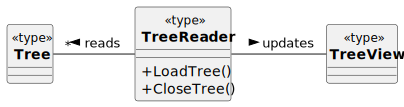

# Treeview and XML connection

The xml structure is completely dictated by the application.
No schema is required. The initially created schema is used only as an auxiliary tool for defining the rules inside the app. 

## Displaying the XML content
The user opens the app and reads the file. The tree is displayed immediatelly. 

The **Tree** is the xml file.
The **Reader** is the app itself.
**TreeView** is provided by the *tkinter* package.