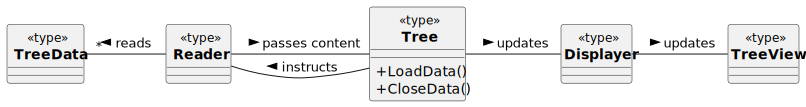
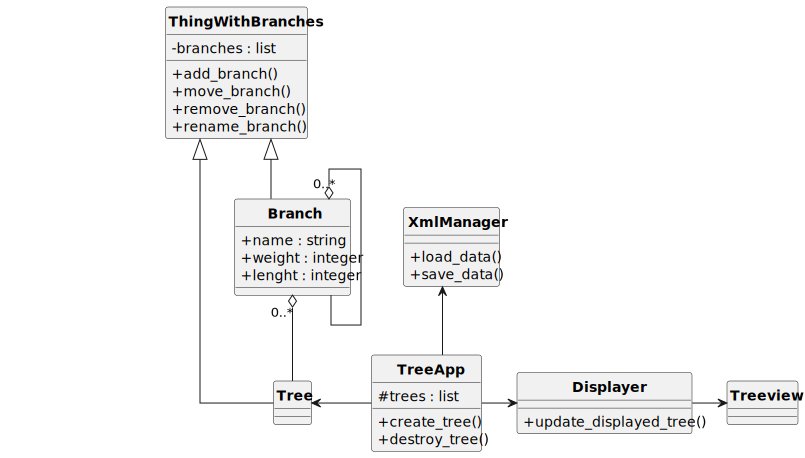
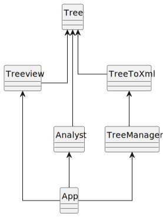

# HoFi2
An abbreviation for home finance. It provides a way to write down expenses, incomes and debts, to plan them and to plan the repayment and the future transactions. 

The following activities are of interest:
- storing information on various transactions and debts;
- planning the transaction and debt repayment;
- displaying the significance of individual transactions, debts and their groups.

The project is licensed under the [MIT License](https://opensource.org/license/mit/), see the [license file](LICENSE).


## How it works
The transactions are stored in a hierachical structure in an xml file. The xml schema defines several objects:
- debts;
- income;
- expense;
- object, that can be parent to other objects and to incomes and expenses.

The xml file should be edited via an user interface written in Python. 

### Template
In the **cases** folder, there is a **template** file, providing a simple example including debt, income, expense and item.

### Debts
The debts are list of all items, that are to be payed in the future (there is no hierarchy, assuming the user wants to keep the number of items here low).

Each debt is described by
- date, when the debt was created;
- description (an arbitrarily long text);
- amount (the money or the cost of the borrowed/lended goods);
- due date (optional).

### Temporal arrangement
The user can enter either future (**planned**) transactions or current or past transactions (**realized**). Those are automatically distinguished by the current date. 

Tommorows and later transactions are treated as the planned transactions. When the current date reaches the date of the planned transaction, the user is prompted on the nearest opening of the program to confirm (with option **Yes**), that the transaction actually happened. If he/she chooses **No**, the transaction is simply deleted from the planned transactions. In the other case, it is marked as realized. 
This should be done via a special list of all the transactions to be confirmed. The user gets single notification on the program start. Then, he/she may or may not proceed to confirmation of the transactions.


# Development notes

## Treeview and XML connection

The xml structure is completely dictated by the application.
No schema is required. The initially created schema is used only as an auxiliary tool for defining the rules inside the app. 

## Displaying the XML content
The user opens the app and reads the file. The tree is displayed immediatelly. 




The structure for holding the displayed data loaded from xml looks like this




## Editing the tree object and its children

### Reporting errors
For example, when attempting to delete branch with some child branches, the branch should be left intact and the program should print an error message.

The rule of not deleting branch with child branches should be maintained by the branch itself.

The branch should basically call some methods for printing out the error message. The branch does not store the printed message neither take care of the particular content (the content is set by the displaying object).

The called methods are provided by the displayer/displayers. 


# The app
The app comprises the xml file handling and managing the tree object indirectly via UI. 

A GUI for the tree management (aside from the treeview) is created. 

The app defines the tree elements' templates (the tags and attributes) and passes them to the tree objects via the UI part responsible for the tree editing (Treeview).

Trees cannot be loaded or unloaded via the Treeview - it can only serve for their editing. That is the job for the TreeManager, which vice versa cannot modify the trees, it only enables to handle them as a whole, to load or save them or to create a new (empty) tree.

The basic structure of the app is shown below, including the Tree object, the App itself and TreeView and TreeToXml converter. The app controls the converted via the TreeManager. The Analyst conducts calculations and a displays the results.




## Where are the xml files?
Files are stored at custom locations. When saving or loading a tree, the user is prompted to specify the file via dialog window.

## Actions of the Tree Manager
- **save** the tree at specific location (the tree name is preserved, and user is prompted to choose a different name, if tree already exists)
- **update** an existing tree; if the xml file to be updated or the directory no longer exist, they are **created** anew and the user is **notified** of this
- **load** the tree from file specified by the user via **dialog window**
- **unload** the tree from the **tree list**


## Named Items List
The rationale for using another object to represent all the trees inside the app is to unify the list of all accessible trees to all of the app's parts: the Tree Manager, the Analyst and Treeview.

The only type of object, that can be stored in the list, it the Tree.

### Adding an item to the Named Items List
- Adding an item with already existing name will result in adding the new item, however under an adjusted name (e.g., if item is added under already taken name "Thing", it will be added as "Thing (1)").


## Updating already existing xml file
The Tree Manager keeps pair of the Tree object and the xml file. When the user chooses the update the file, the program checks, that the file is still present. If it is, the file is updated. If not, the user is notified of the missing file and asked to either specify the new location of the file or to cancel the operation.

If the tree is renamed in the app, after the update the file is also renamed. If the name is already taken, the user is prompted to choose another name or to export the tree to other location.


## Properties Widget
The widget shows the properties of an item selected in the Editor. The editor should notify the Properties of the selection and send to it the data. It serves as an extension to the Editor. The Editor should prompt the Properties to redraw on the following events:
- selection of some new item,
- confirming changes of a selected item,
- confirming changes of some of the selected item's children
The Properties get cleared, when
- the item is deselected,
- the item is removed from editor


## Defining the item types
The App must be able to tell the Manager and Editor, what types of TreeItems to create - under which tags and with what attributes. 

Attributes are subject to validation when being changed (possible types are non-negative integers, dates and strings). The tag determines also the TreeItem type, i.e. if it is a branch (assumed to contain child items) or a leaf (a data point, without children).

Template has to contain the following information:
- **name** (label) of the template;
- names and default values of an item's **attributes** (default values serves for automatic recognition of the attributes' types),
- of templates of the item's possible **children** (empty list denotes a 'leaf' type, meaning no children are expected).

The template ought to be used as following:
- **Name** determines the template that should be used for creating new item. It is also used as a **tag** in exported xml file. First, such a taginforms the user when viewing the xml file and second and more importantly, it determines the template when loading the xml back to the app and constructing the Tree object and its children.
- **Attributes** are translated into a dictionary and passed to the function creating new item.
- **Children tags** is a list of tags, that is stored in each of the created in items. When the method creating the children of this items is called, one of the method's arguments is the tag of the template used for the child's creation. These tags also determine the available options for adding new item in the Editor UI. 

The templates are stored in an object inside the tree module.

An example of a template dictionary:
``` python
{
    'Tree':     {"name": "New tree", "weight": 1000, "age": 45, "children":('Branch','Leaf')},
    'Branch':   {"name": "New branch", "weight": 100, "children":('Branch','Leaf')},
    'Leaf':     {"name": "New leaf", "surface": 0.01, "children":()}
}
```

The the dictionary is stored as a part of a template object, than allows to modify the dictionary and also check, that for example, the "name" and "children" objects are always present and that the items inside 'children' tuples are correspond to the template names.


The process of defining the item using some kind of template starts with depicting how the app works:


## Dependent branch and tree attributes
When entering the tree/branch template, it is possible to pass a tuple as an default value. The first elements is a callable, that denotes a function. The function's arguments are denoted by the attribute labels, which are passed as the remaining elements of the tuple. The function is allowed to have only positional arguments.

This makes the program to evaluate the expression as a function of previously defined attributes of the current item, its children or its parent.


## Localization
The application is supplied in multiple languages. 

## Currency
The currency is independent of the application language and it is specific for each tree. When displaying results, total income or expense per item etc., the values are displayed using this currency.

When item is being added or edited, the currency is customary and can be selected by dropdown menu next to the value. The value can be entered as a positive float number, but after confirming the changes, the value is rounded according to the currency (e.g., to 2 decimal places for euro or US dollar or to whole number in the case of yen). 

When conversion is applied, to estimate the exchange rate, a date has to be specified. By default, the transaction date is selected. The user can pass a custom date, for which the value is converted. 


